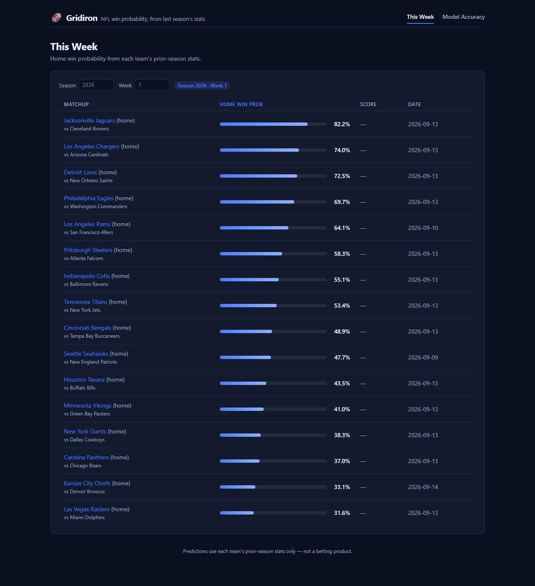
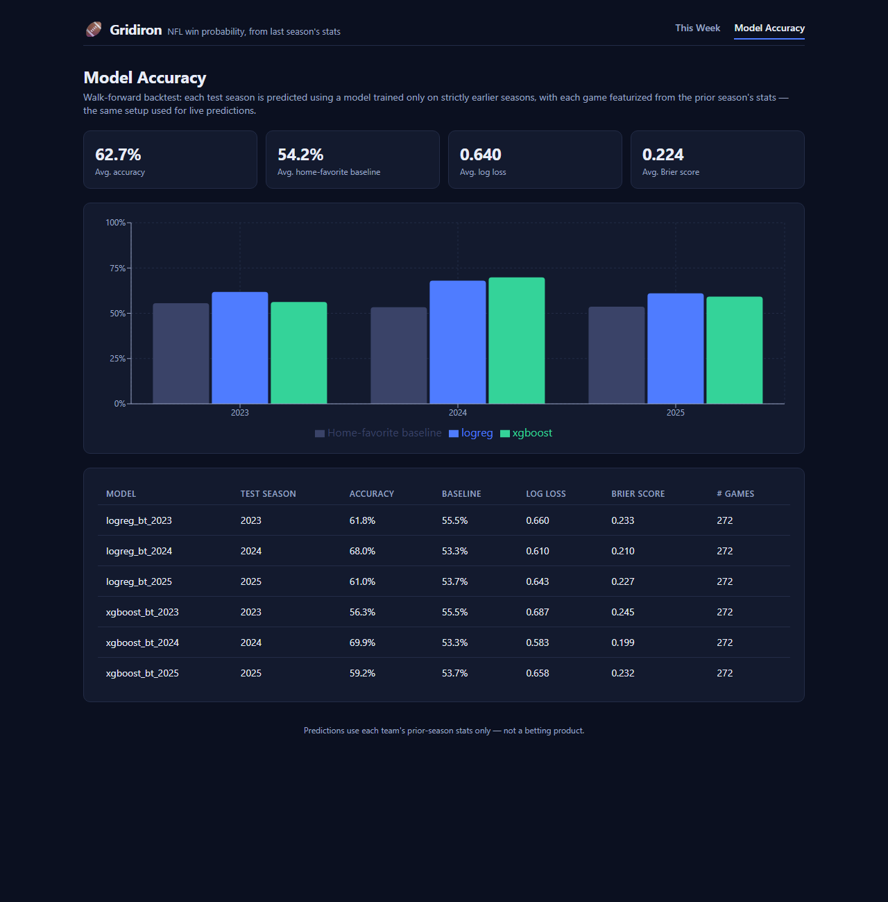
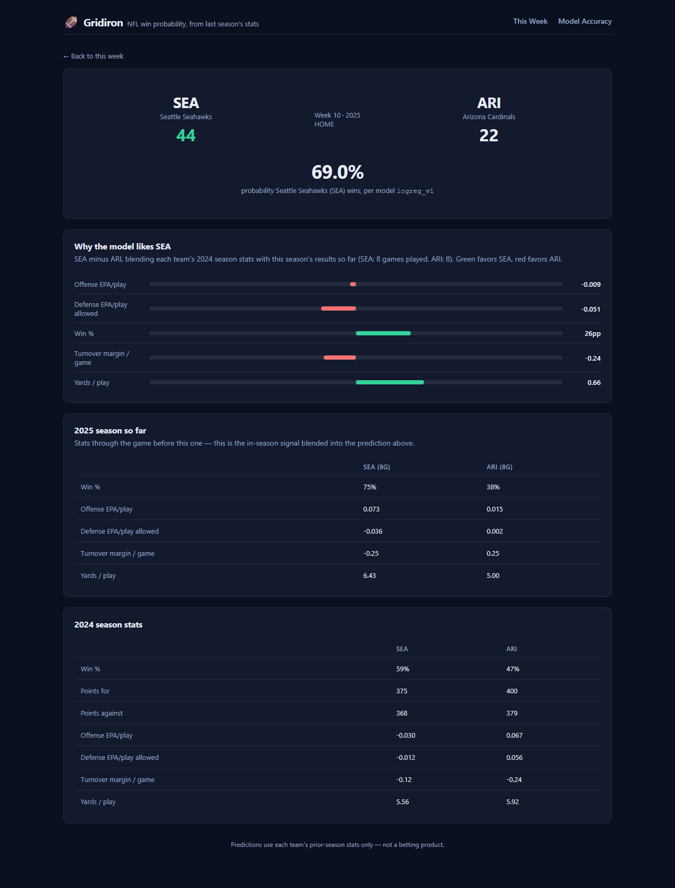

# 🏈 Gridiron

**NFL win probability from real play-by-play data — a prior-season baseline that adapts as the current season's results come in, backtested walk-forward so the numbers can't lie to themselves.**

Gridiron pulls real NFL play-by-play and schedule data, builds a feature set from each team's performance, trains a win-probability model, and validates it the way it'll actually be used: predicting a season using only the data that would have been available before kickoff, repeated across multiple years. Full stack, containerized, tested end-to-end against real data.

<p align="center">
  
  
  
  
  
  
  
</p>

<p align="center">
  
</p>

## Why this exists

Most "NFL predictor" side projects report a single accuracy number and call it done. The interesting question is different: **does a model trained the way you'd actually use it — last season's numbers, updated as this season actually happens — beat just picking the home team?** Gridiron is built around answering that honestly:

- Every feature starts from a team's **prior season** stats, so week 1 of a new season is never using data that wouldn't have existed yet.
- As the season progresses, each team's **current-season-to-date** stats get blended in (shrinkage-weighted by games played — a team's own 8 games this year gradually outweigh an entire year-old season), so predictions actually respond to real form instead of being frozen the day the season starts.
- The backtest is **walk-forward**: for each test season, the model is trained *only* on strictly earlier seasons, then evaluated using exactly the same prior-season/in-season blend a live prediction would use.
- It's checked against the obvious baseline (always pick the home team) every time, not just once.

## Results

Walk-forward backtest, logistic regression, three most recent completed seasons:

| Test season | Accuracy | Home-favorite baseline | Log loss | Brier score |
|---|---|---|---|---|
| 2023 | **61.8%** | 55.5% | 0.660 | 0.233 |
| 2024 | **68.0%** | 53.3% | 0.610 | 0.210 |
| 2025 | **61.0%** | 53.7% | 0.643 | 0.227 |

Beats the baseline by 6–15 points across all three seasons. Blending in in-season form is what took this from a modest ~3-point edge (prior-season stats alone) to this — makes sense, since a lot can change for a team between one September and the next. An XGBoost variant is also included for comparison and now consistently beats the baseline too, edging out logistic regression in 2024/2025 while lagging slightly in 2023 — see the live chart in the app, or [`progress.md`](progress.md) for the full methodology notes and a couple of real bugs the test suite caught along the way.

<p align="center">
  
</p>

## How a prediction is made

For a game between a home and away team in season *N*, week *W*, each of five stats (EPA/play on offense and defense, turnover margin, win %, yards/play) is a blend of:

1. The team's full **season N-1** stats (always available, the floor).
2. The team's **season N stats through week W-1** — weighted in via a shrinkage formula: treat the entire prior season as worth 6 games of current-season evidence, so the blend crosses 50/50 by a team's 7th game of the new season. Week 1 always has zero games played, so it's mathematically identical to using prior-season stats alone.

The model's actual inputs are then the home-minus-away diff of each blended stat, plus a constant home-field flag:

`epa_offense_diff` · `epa_defense_diff` · `turnover_margin_diff` · `win_pct_diff` · `yards_per_play_diff` · `home_flag`

Team-level offensive *and* defensive EPA come from play-by-play data rather than `nfl_data_py`'s weekly summaries — weekly data is player-offense-only with no defensive signal, so `epa_defense` can't be derived from it. Play-by-play carries `posteam`/`defteam` on every row, which gives both sides correctly. Games where a team has no prior-season stats at all (e.g. the edge of the data window) are dropped from training and evaluation — in-season data can supplement a prior season, not substitute for a missing one.

The game detail page shows exactly why the model favors a team — the blended diffs it was trained on, visualized, plus the raw in-season and prior-season numbers behind them:

<p align="center">
  
</p>

## Stack

| Layer | Tech |
|---|---|
| Data source | [`nfl_data_py`](https://github.com/nflverse/nfl_data_py) (schedules + play-by-play, sourced from nflverse) |
| ML | pandas, scikit-learn (logistic regression), XGBoost (optional) |
| API | FastAPI + SQLAlchemy 2.0 |
| Database | PostgreSQL 16 |
| Frontend | React 19, TypeScript, Vite, react-router, recharts |
| Infra | Docker Compose (db + api + scheduler + frontend) |

## Staying current through the season

Two things need to stay fresh as a season plays out: which games have final scores (so in-season stats-to-date are accurate), and which upcoming weeks have predictions at all. Note what *doesn't* need to change: a prediction for a specific game is only ever a function of both teams' stats as of right before that game, so re-running things doesn't retroactively change predictions for games that already happened — it only affects newly-computed predictions for games later in the schedule, which now see one more week of results in their blend.

The Docker Compose stack includes a `scheduler` service (`backend/ml/scheduler.py`) that handles this on its own: once a day it re-runs ingest (pulling fresh scores/schedule/in-season stats) and regenerates predictions for the current season. It retries every 5 minutes instead of waiting a full day if a refresh fails (e.g. racing the API container's first-boot bootstrap, or a transient upstream hiccup) — no manual intervention needed. Outside Docker, do the same thing with a cron job or scheduled task calling `python -m ml.ingest && python -m ml.predict --version logreg_v1 --season <year>`, or just re-run those commands yourself whenever you want fresh results.

## Quickstart (Docker)

```bash
git clone https://github.com/jamesmartin6/gridiron.git
cd gridiron
docker compose up --build
```

That's it. On first boot, the API container automatically pulls the last several seasons of real NFL data (including week-by-week in-season stats, which is the slow part — expect ~1-2 minutes), trains the default model, runs the backtest, and predicts the current season's games — no manual steps required. It's idempotent, so restarting the stack later won't re-pull or re-train.

- Frontend: <http://localhost:5173>
- API docs (Swagger): <http://localhost:8000/docs>

A `scheduler` container keeps scores and predictions current automatically (see below) — ingest/predict don't need to be run by hand. Training and backtesting are still manual, since retraining on a schedule wasn't in scope; re-run them yourself after a season wraps up, or any time you want to force a refresh:

```bash
docker compose exec api python -m ml.ingest
docker compose exec api python -m ml.train --seasons 2020 2021 2022 2023 2024 2025
docker compose exec api python -m ml.backtest --seasons 2023 2024 2025
docker compose exec api python -m ml.predict --version logreg_v1 --season 2026
```

> **Note:** the Dockerfiles and compose config were built and syntax/path-validated in a sandbox without a Docker daemon available — the full pipeline they run (ingest → train → backtest → predict) was verified end-to-end against a real local Postgres instance instead. If `docker compose up --build` surfaces anything, it's most likely a container-specific wrinkle rather than a logic bug; see [`progress.md`](progress.md) for exactly what was and wasn't container-tested.

## Local development (without Docker)

<details>
<summary>Backend</summary>

```bash
cd backend
python -m venv .venv && source .venv/bin/activate   # or .venv\Scripts\activate on Windows
pip install -r requirements.txt
pip install nfl_data_py==0.3.3 --no-deps   # see requirements.txt for why this is separate

cp .env.example .env   # point DATABASE_URL at your Postgres

python -m ml.ingest
python -m ml.train --seasons 2020 2021 2022 2023 2024 2025
python -m ml.backtest --seasons 2023 2024 2025
python -m ml.predict --version logreg_v1 --season 2026

uvicorn app.main:app --reload
pytest
```
</details>

<details>
<summary>Frontend</summary>

```bash
cd frontend
npm install
cp .env.example .env   # point VITE_API_BASE_URL at your API
npm run dev
npm test
npm run build
```
</details>

## API

| Endpoint | Description |
|---|---|
| `GET /teams` | All teams |
| `GET /teams/{team_id}/stats?season=` | A team's season stat line |
| `GET /games?season=&week=` | Games for a season/week, with predictions attached (defaults to the latest upcoming week) |
| `GET /predictions/{game_id}` | Prediction + full feature breakdown for one game, including the blended and raw in-season/prior-season stats behind it |
| `GET /backtest` | All backtest results (accuracy/log-loss/Brier vs. baseline, per season) |
| `POST /predict?season=&week=` | Admin: runs the current model over a season/week and writes predictions |
| `POST /ingest` | Admin: refreshes teams/season_stats/games/weekly_team_stats from `nfl_data_py` |

Full interactive docs at `/docs` once the API is running.

## Project structure

```
gridiron/
  backend/
    app/            # FastAPI app: models, schemas, routers, config
    ml/              # ingest, features, train, backtest, predict, bootstrap
    tests/            # pytest — unit, ML pipeline, API (against a real throwaway Postgres db)
    Dockerfile
  frontend/
    src/
      pages/          # ThisWeek, GameDetailPage, BacktestPage
      components/     # WinProbBar, DiffBar, Nav
      api/            # typed fetch client
    Dockerfile
  docs/
    build-spec.md     # original project spec
    screenshots/
  docker-compose.yml
  progress.md          # build log: what's done, decisions made, bugs found
```

## Testing

- **Backend**: 32 pytest tests — feature-engineering and in-season-blending unit tests, full ML pipeline (train/backtest/predict) against deterministic synthetic data seeded into a real Postgres, API endpoint tests via `TestClient` against a throwaway `_test` database, and season-range date-logic tests. `cd backend && pytest`.
- **Frontend**: 17 Vitest + Testing Library tests covering all three pages and shared components. `cd frontend && npm test`.
- The whole app was also driven end-to-end in a real headless browser (screenshots above) to confirm it actually renders against live data with no console errors — not just that the test suites pass.

## Scope

Regular season only; no playoff modeling, no betting-line integration, no player-level injury data, no automated retraining (`/ingest` and `/predict` are manual/on-demand triggers — see [`docs/build-spec.md`](docs/build-spec.md) for the full original spec this was built against).

## License

[MIT](LICENSE)
